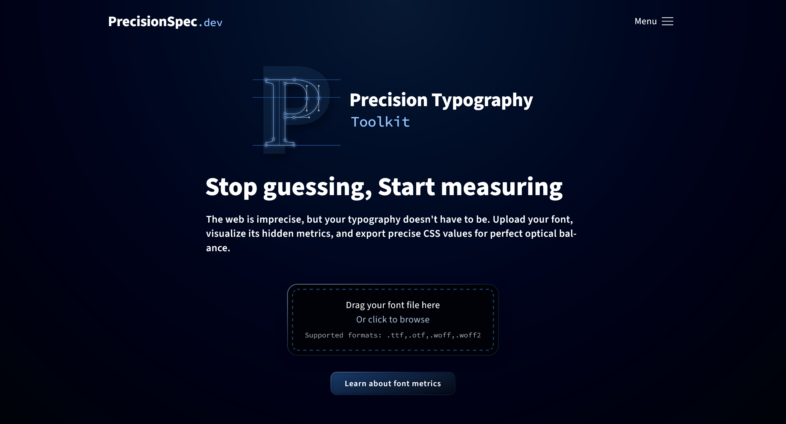
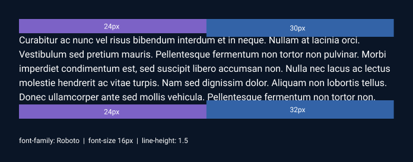
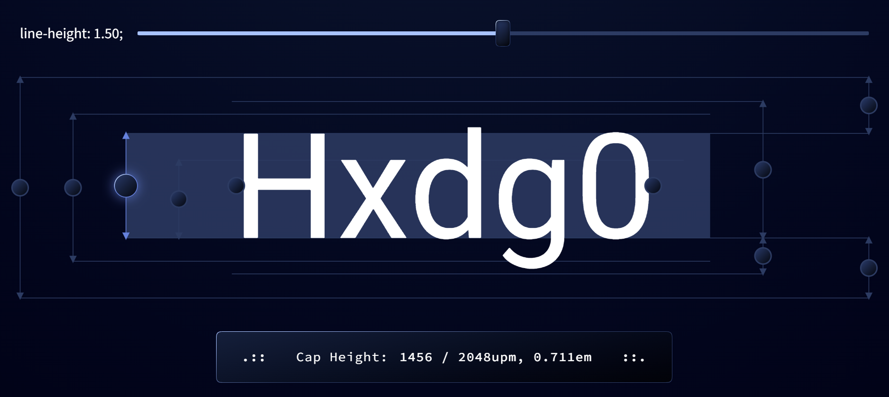
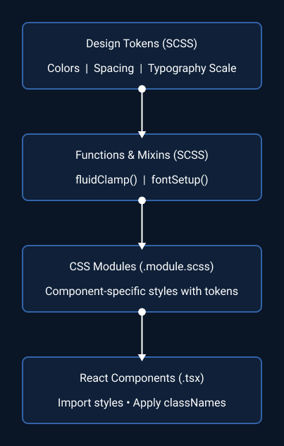
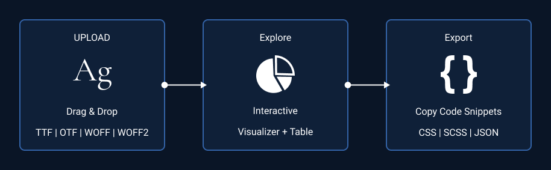
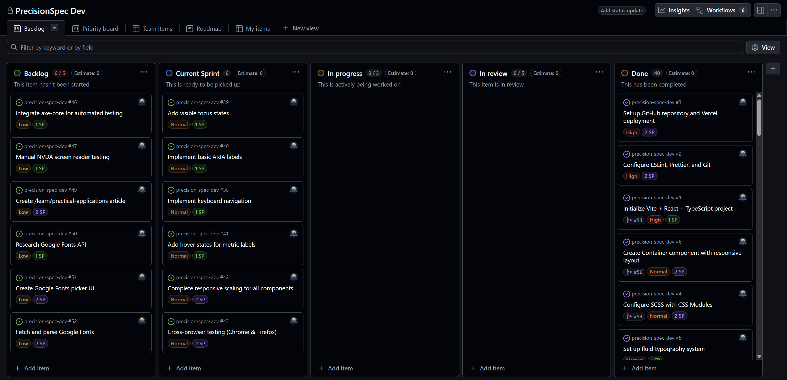
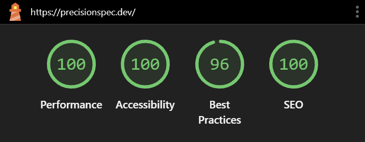

# PrecisionSpec.dev

**A precision typography toolkit for web developers**

Extract font metrics, visualize typographic measurements, and generate CSS custom properties, SCSS Map and JSON Object for pixel-perfect web typography.



---

## Table of Contents

- [Overview](#overview)
- [The Problem](#the-problem)
- [The Solution](#the-solution)
- [Features](#features)
- [Tech Stack](#tech-stack)
- [Architecture](#architecture)
- [Installation](#installation)
- [Usage](#usage)
- [Project Structure](#project-structure)
- [Key Technical Decisions](#key-technical-decisions)
- [Testing](#testing)
- [Performance](#performance)
- [Accessibility](#accessibility)
- [Browser Support](#browser-support)
- [Roadmap](#roadmap)
- [Contributing](#contributing)
- [License](#license)
- [Related projects](#related-projects)

---

## Overview

PrecisionSpec.dev is a web-based typography toolkit that bridges the gap between font design and web development. It extracts precise metrics from font files and provides developers with the mathematical data needed to achieve pixel-perfect typography alignment in CSS.

**Live Demo:** [precisionspec.dev](https://precisionspec.dev)

### Project Context

This project was created as a thesis project (Examensarbete) for the Front-End Development program at Medieinstitutet Stockholm, completed in January 2026.

**Timeline:** 6 weeks full-time (240 hours)  
**Student:** Egil Eskilsson 
**Supervisor:** Jenni Litoreus

---

## The Problem

Web developers face a persistent challenge: CSS treats text as rectangular boxes, but typography is fundamentally about shapes and optical balance. This creates several issues:

1. **Invisible space**: Fonts contain built-in vertical space (leading) and horizontal space (side-bearings) that CSS cannot fully see or control
2. **Misalignment**: Text rarely aligns precisely with design grids due to these invisible metrics
3. **Inconsistency**: Different fonts have wildly different internal spacing, making consistent layouts difficult
4. **Manual guesswork**: Developers resort to arbitrary padding adjustments without understanding the underlying math

### Real-World Impact



When a designer creates a layout with 24px spacing between elements, the actual visual spacing might be 18px or 30px depending on the font's internal metrics. This leads to:

- Pixel-pushing frustration
- Inconsistent spacing across typefaces
- Difficulty achieving design-developer parity
- Time wasted on manual adjustments

---

## The Solution

PrecisionSpec.dev solves this by:

1. **Extracting precise font metrics** using the fontkit library to read OpenType font files
2. **Visualizing the invisible** through interactive SVG diagrams showing cap-height, x-height, ascenders, descenders, and side-bearings
3. **Calculating optical edges** by determining the exact distance from the font container to the actual glyph
4. **Generating CSS custom properties** that developers can use to achieve true optical alignment



### How It Works

```typescript
// Upload a font → Extract metrics → Apply to CSS

// Example output:
:root {
  --font-cap-height: 0.700em;
  --font-x-height: 0.486em;
  --font-ascender: 0.812em;
  --font-descender: 0.188em;
  --font-top-trim: -0.152em;
  --font-bottom-trim: -0.188em;
  --font-lsb-adjust: -0.0648em;
  --font-rsb-adjust: -0.0516em;
}
```

---

## Features

### Core Features

- **Font Upload**: Drag-and-drop interface supporting TTF, OTF, WOFF, and WOFF2 formats
- **Metric Extraction**: Precise extraction of font metrics normalized to em units
- **Interactive Visualization**: SVG-based diagrams showing font anatomy with hover states
- **Metric Table**: Comprehensive table displaying all extracted measurements
- **Export Functionality**: Generate CSS custom properties for immediate use
- **Line Height Adjustment**: Real-time visualization of how line-height affects spacing
- **Side-Bearing Calculator**: Weighted average calculation for optical edge alignment

### Educational Content

- **Learning Articles**: In-depth explanations of font metrics and precision typography
- **Demonstrative Diagrams**: Live examples showing the impact of optical alignment
- **Mathematical Foundations**: Clear explanations of the formulas behind the calculations

---

## Tech Stack

### Core Technologies

- **React 19.2** - UI framework with latest concurrent features
- **TypeScript 5.9** - Type safety and developer experience
- **Vite 7.2** - Build tool and development server
- **React Router 7.1** - Client-side routing with lazy loading

### Styling & Design

- **SCSS (Sass Embedded 1.97)** - Advanced CSS preprocessing
- **CSS Modules** - Scoped styling to prevent conflicts
- **CSS Custom Properties** - Dynamic theming and design tokens
- **Fluid Typography** - Responsive type scaling using clamp()

### Font Processing

- **fontkit 2.0** - OpenType font parsing and metric extraction
- **Buffer (polyfill)** - Node.js buffer support in browser environment

### UI/UX Libraries

- **clsx** - Conditional className utility
- **focus-trap-react** - Keyboard navigation and accessibility
- **react-remove-scroll** - Body scroll locking for modals

### Development Tools

- **ESLint 9** - Code linting with modern flat config
- **Prettier 3.7** - Code formatting
- **Vitest 4.0** - Unit and integration testing
- **@testing-library/react** - Component testing utilities
- **TypeScript ESLint** - TypeScript-specific linting rules

### Build & Optimization

- **PostCSS & Autoprefixer** - CSS vendor prefixing
- **Sharp** - Image optimization
- **Placeholder** - Blur placeholder generation for images
- **vite-plugin-svgr** - SVG as React components

---

## Architecture

### Design Patterns

#### Component Architecture

The project follows a **feature-based component structure** with clear separation of concerns:

```
src/
├── components/         # Reusable UI components
│   ├── forms/          # Form elements (Button, Toggle, DropZone)
│   ├── layout/         # Layout components (Container, Flex, Grid)
│   ├── typography/     # Typography components (Heading, Text)
│   └── ui/             # UI components (Icon, PageLoader)
├── pages/              # Route-level page components
├── hooks/              # Custom React hooks
├── utils/              # Pure utility functions
├── types/              # TypeScript type definitions
└── styles/             # Global styles and design system
```

#### State Management

- **React Context API** for font metrics state
- **useReducer** for complex state logic
- **localStorage** for persistence between sessions
- **Custom hooks** for reusable stateful logic

#### Styling Architecture

The SCSS architecture follows the **7-1 pattern** adapted for this project:

```
styles/
├── abstracts/         # Variables, functions, mixins
├── base/              # Reset, typography, global styles
├── components/        # Component-specific styles
├── tokens/            # Design tokens (leading-trim, color, spacing)
└── utilities/         # Utility classes
```

**Key architectural decisions:**

1. **CSS Modules** for component isolation
2. **Design tokens** for consistency
3. **Mixins** for typography setup (`fontSetup` mixin)
4. **Functions** for fluid calculations



---

## Installation

### Prerequisites

- **Node.js 20+** (recommended: use nvm)
- **npm 10+** or **pnpm 9+**

### Clone & Install

```bash
# Clone the repository
git clone https://github.com/[your-username]/precision-spec-dev.git

# Navigate to project directory
cd precision-spec-dev

# Install dependencies
npm install

# Start development server
npm run dev
```

The application will be available at `http://localhost:5173`

### Build for Production

```bash
# Type check
npm run check-types

# Build
npm run build

# Preview production build
npm run preview
```

---

## Usage

### Basic Workflow

1. **Upload a Font**
   - Drag and drop a font file onto the drop zone
   - Or click to browse and select a font file
   - Supported formats: TTF, OTF, WOFF, WOFF2

2. **Explore Metrics**
   - View the interactive metric visualization and/or the metric table
   - Click on individual metrics to highlight them
   - Adjust line-height to see real-time changes

3. **Export CSS**
   - Click "Export Metrics"
   - Copy the generated CSS custom properties
   - Use in your project for precision typography



### Example: Simple usage of exported metrics

```css
/* Import the exported CSS custom properties */
@import './font-metrics.css';

/* Apply to your typography */
.heading {
  font-size: 3rem;
  line-height: 1.2;
  
  /* Remove excess vertical space */
  margin-top: calc(var(--font-top-trim) - ((1lh -1em) / 2));
  margin-bottom: calc(var(--font-bottom-trim) - ((1lh -1em) / 2));
  
  /* Align to optical edge */
  margin-left: var(--font-lsb-adjust);
  margin-right: var(--font-rsb-adjust);
}
```

---

## Project Structure

```
precision-spec-dev/
├── public/
│   └── fonts/                  # App font files
├── src/
│   ├── assets/
|   |   ├── fonts/              # Visualizer default font
│   │   └── icons/              # SVG icon components
│   ├── components/
│   │   ├── forms/
│   │   │   ├── Button/         # Versatile button component
│   │   │   ├── DropZone/       # File upload component
│   │   │   ├── ThumbSlider/    # Range input component
│   │   │   └── Toggle/         # Toggle switch component
│   │   ├── layout/
│   │   │   ├── Container/      # Layout container
│   │   │   ├── Flex/           # Flexbox wrapper
│   │   │   └── Grid/           # Grid wrapper
│   │   ├── typography/
│   │   │   ├── Heading/        # Semantic headings
│   │   │   └── Text/           # Body text component
│   │   ├── ui/
│   │   │   └── Icon/           # Icon wrapper component
│   │   └── visualizations/
│   │       └── FontMetricsSvg/ # SVG metric diagrams
│   ├── hooks/
│   │   ├── useDropZone.ts      # File upload logic
│   │   ├── useMediaQuery.ts    # Responsive breakpoints
│   │   └── useLocalStorage.ts  # localStorage hook
│   ├── layouts/
│   │   └── MainLayout/         # App shell layout
│   ├── pages/
│   │   ├── tools/
│   │   │   └── PrecisionTypographyToolkit/  # Main tool page
│   │   └── learning/
│   │       ├── FontMetricsAndWebTypography/ # Educational article
│   │       └── PrecisionAlignment/          # Educational article
│   ├── styles/
│   │   ├── abstracts/        # SCSS variables, functions, mixins
│   │   ├── base/             # Global styles, reset, typography
│   │   ├── tokens/           # Design tokens
│   │   └── utilities/        # Utility classes
│   ├── types/                # TypeScript definitions
│   ├── utils/
│   │   ├── fontParser.ts     # Font metric extraction
│   │   └── localStorage.ts   # Storage utilities
│   ├── App.tsx
│   ├── Router.tsx
│   └── main.tsx
├── docs/
│   └── screenshots/          # README screenshots
├── scripts/                  # Build scripts
├── .eslintrc.js
├── .prettierrc
├── tsconfig.json
├── vite.config.ts
└── vitest.config.ts
```

## Project Management

This project was managed using GitHub Projects with a Kanban board following agile methodology:

- **Sprint Planning**: 3 two-week sprints aligned with the activity plan
- **Task Tracking**: Issues tracked progress and blocked items
- **Commit Convention**: Conventional commits for clear history
- **Branching**: Feature branches merged via pull requests



---

## Key Technical Decisions

### 1. Why React + TypeScript?

**Decision:** Use React 19 with TypeScript for the UI

**Rationale:**
- **Type Safety**: TypeScript catches errors at compile time, crucial for complex font metric calculations
- **Component Reusability**: React's component model allows for building a consistent design system
- **Modern Features**: React 19's concurrent features improve performance for heavy calculations
- **Ecosystem**: Rich ecosystem of tools and libraries for font processing

**Trade-offs:**
- Heavier bundle size compared to vanilla JS
- Build step required
- Learning curve for TypeScript

**Alternatives Considered:**
- Vue 3: Simpler API but smaller ecosystem for font processing
- Svelte: Better performance but less mature TypeScript support
- Vanilla JS: Maximum performance but poor maintainability at scale

### 2. Why SCSS over CSS-in-JS or Tailwind?

**Decision:** Use SCSS with CSS Modules

**Rationale:**
- **Mathematical Power**: SCSS functions essential for fluid typography calculations
- **Design System**: Variables and mixins create consistent design tokens
- **Performance**: No runtime overhead unlike CSS-in-JS
- **Maintainability**: Clear separation of concerns, easy to audit
- **Professional Practice**: SCSS is standard in enterprise front-end development

**Example - Fluid Typography Function:**

```scss
@function fluidFontSize($min, $max, $minVw, $maxVw) {
  $slope: ($max - $min) / ($maxVw - $minVw);
  $yIntersect: $min - ($slope * $minVw);
  
  @return clamp(
    #{$min}px,
    #{$yIntersect}px + #{$slope * 100}vw,
    #{$max}px
  );
}
```

**Trade-offs:**
- Build step required
- Global namespace conflicts (mitigated by CSS Modules)
- No type checking for styles (unlike CSS-in-JS)

### 3. Why fontkit for Font Parsing?

**Decision:** Use fontkit library for OpenType parsing

**Rationale:**
- **Accuracy**: Direct access to OpenType tables
- **Completeness**: Extracts all necessary metrics (cap-height, x-height, side-bearings)
- **Reliability**: Mature library used in professional typography tools
- **Format Support**: Handles TTF, OTF, WOFF, WOFF2

**Implementation Challenge:**

Fontkit is a Node.js library requiring Buffer polyfill for browser use:

```typescript
// vite.config.ts
export default defineConfig({
  resolve: {
    alias: {
      buffer: 'buffer',
    },
  },
  optimizeDeps: {
    include: ['buffer'],
  },
});
```

### 4. Why React Context over Redux?

**Decision:** Use React Context API + useReducer for state management

**Rationale:**
- **Simplicity**: No need for Redux boilerplate for this scope
- **Performance**: State updates are localized to font metrics
- **Built-in**: No additional dependencies
- **Sufficient**: Application state is not deeply nested or complex

**Context Structure:**

```typescript
type FontMetricsState = {
  fontFamily: string | null;
  fontFile: File | null;
  metrics: FontMetrics | null;
  isLoading: boolean;
  error: string | null;
  selectedMetric: string | null;
};
```

### 5. Why Vitest over Jest?

**Decision:** Use Vitest for testing

**Rationale:**
- **Vite Integration**: Native support, uses same config
- **Performance**: Faster test execution
- **Modern Features**: Better ESM support
- **API Compatibility**: Jest-compatible API, easy migration

---

## Testing

### Test Coverage

The project uses Vitest for unit and integration testing:

```bash
# Run tests
npm run test

# Run tests with UI
npm run test:ui

# Generate coverage report
npm run test:coverage
```

### Testing Strategy

1. **Unit Tests**: Individual utility functions (font parsing, calculations)
2. **Component Tests**: UI components with @testing-library/react
3. **Integration Tests**: User workflows (upload → extract → export)

### Example Test

```typescript
// fontParser.test.ts
import { describe, it, expect } from 'vitest';
import { parseFontFile } from './fontParser';

describe('parseFontFile', () => {
  it('extracts correct cap-height from font', async () => {
    const mockFontFile = new File([/* ... */], 'test.woff2');
    const metrics = await parseFontFile(mockFontFile);
    
    expect(metrics.capHeight).toBeCloseTo(0.700, 3);
  });
});
```

**Current Test Coverage:** ~55%, ~90% on critical modules

---

## Performance

### Optimization Techniques

1. **Code Splitting**: React Router lazy loading for page components
2. **Image Optimization**: Sharp for responsive images, blur placeholders
3. **Font Loading**: Font Loading API to prevent FOUT/FOIT
4. **Bundle Size**: Tree-shaking and dynamic imports
5. **CSS**: Minimal runtime overhead with SCSS compilation

### Performance Metrics

```bash
# Lighthouse scores
Performance: 100/100 (88/100 on mobile)
Accessibility: 100/100
Best-Practices: 96/100
SEO: 100/100
```



### Bundle Analysis

```bash
# Analyze bundle size
npm run build
npx vite-bundle-visualizer
```

---

## Accessibility

### Standards Compliance

- **WCAG 2.1 Level AA** compliance
- Semantic HTML5 elements
- ARIA attributes for dynamic content
- Keyboard navigation support
- Focus management in modals
- Screen reader tested

### Accessibility Features

- All interactive elements keyboard accessible
- Focus trap in navigation drawer
- Proper heading hierarchy
- Alt text for all images
- High contrast text (4.5:1 minimum)
- No color-only information
- Skip to content link

---

## Browser Support

- **Chrome/Edge**: 88+ (full support)
- **Firefox**: 78+ (full support)
- **Safari**: 14+ (full support)
- **Mobile**: iOS Safari 14+, Chrome Android 88+

### Progressive Enhancement

The application uses feature detection for:
- Font Loading API
- CSS `text-box-trim` (with polyfill fallback)
- CSS Custom Properties
- CSS Grid/Flexbox

---

## Roadmap

### Completed (v1.0)

- [x] Font upload and parsing
- [x] Metric visualization
- [x] CSS export functionality
- [x] Educational articles
- [x] Responsive design
- [x] Accessibility compliance

### Planned

- [ ] **How to use metrics articles**: How to use in both Vanilla CSS and SCSS

### Future Considerations

- [ ] **Multi-font comparison**: Side-by-side comparison of multiple fonts
- [ ] **Font family upload**: Batch upload for entire font families
- [ ] **Variable font support**: Axis controls and metric changes
- [ ] **Light mode**: User preference for color scheme
- [ ] **OpenType feature visualization**: Show ligatures, alternates, etc.
- [ ] **Font pairing suggestions**: AI-powered recommendations
- [ ] **PDF report generation**: Professional metric documentation
- [ ] **Internationalization**: Support for non-Latin scripts

---

## Contributing

This is a thesis project and is not currently open for external contributions. However, feedback and bug reports are welcome!

### Reporting Issues

If you find a bug or have a suggestion:

1. Check existing issues first
2. Create a new issue with:
   - Clear description
   - Steps to reproduce (for bugs)
   - Expected vs actual behavior
   - Screenshots if applicable

---

## License

This project is licensed under the MIT License - see the [LICENSE](LICENSE) file for details.

---

## Author

**Egil Eskilsson**

- GitHub: [@bluemountain3d](https://github.com/bluemountain3d)
- LinkedIn: [linkedin.com/in/egileskilsson](https://www.linkedin.com/in/egileskilsson/)
- Portfolio: [prortfolio.egileskilsson.se](https://portfolio.egileskilsson.se/)

---

## Acknowledgments

- **Medieinstitutet Stockholm** for the Front-End Development program
- **Jenni Litoreus** for guidance and feedback
- **fontkit** library by Devon Govett
- **The typography community** for inspiration and resources

---

## Related Projects

- **[TrimScale CSS](https://github.com/bluemountain3d/trimscale-css)** — A framework-agnostic SCSS design system that applies the font-metric and leading-trim math developed in this thesis to a production-ready, reusable styling toolkit.
---

## References & Resources

### Typography Theory

- [The Elements of Typographic Style](https://www.amazon.com/Elements-Typographic-Style-Robert-Bringhurst/dp/0881792063) by Robert Bringhurst
- [Thinking with Type](https://thinkingwithtype.com/) by Ellen Lupton
- [Butterick's Practical Typography](https://practicaltypography.com/)

### Technical Resources

- [OpenType Specification](https://docs.microsoft.com/en-us/typography/opentype/spec/)
- [CSS Text Module Level 4](https://www.w3.org/TR/css-text-4/)
- [Variable Fonts Guide](https://variablefonts.io/)

### Inspiration

- [Type Scale](https://typescale.com/) by Jeremy Church
- [Gridlover](https://www.gridlover.net/) by Tuomas Jomppanen
- [Capsize](https://seek-oss.github.io/capsize/) by SEEK OSS

---

**Built with precision. Designed for developers. Made with ❤️ in Stockholm.**
